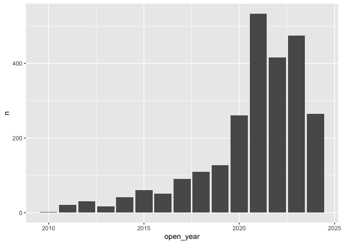

<!-- README.md is generated from README.Rmd. Please edit that file -->

# nreltools

<!-- badges: start -->

[](https://github.com/andypicke/nreltools/actions/workflows/R-CMD-check.yaml)
<!-- badges: end -->

[nreltools](https://github.com/andypicke/nreltools) provides functions
for working with APIs and tools from the [NREL Developer
Network](\https://developer.nrel.gov/) in R.

To use the tools you will need to [sign up for a free API
key](https://developer.nrel.gov/signup/). The package functions assume
by defauls that you have stored your API Key as “NREL_DEVELOPER_API_KEY”
in you .Renviron file.

## Installation

You can install the development version of nreltools like so:

``` r
# install.packages("devtools")
#devtools::install_github("andypicke/nreltools")
```

## Examples

### Get EV charging stations for one state

``` r

library(nreltools)
library(dplyr)
#> 
#> Attaching package: 'dplyr'
#> The following objects are masked from 'package:stats':
#> 
#>     filter, lag
#> The following objects are masked from 'package:base':
#> 
#>     intersect, setdiff, setequal, union

ev <- nreltools::afdc_ev_get_stations(wh_state = "CO")

glimpse(ev)
#> Rows: 2,514
#> Columns: 47
#> $ access_code                <chr> "public", "public", "public", "private", "p…
#> $ access_days_time           <chr> "24 hours daily; pay lot", "24 hours daily"…
#> $ access_detail_code         <chr> NA, NA, "CALL", NA, NA, "CALL", NA, "CALL",…
#> $ cards_accepted             <chr> NA, NA, NA, NA, NA, NA, NA, NA, NA, NA, NA,…
#> $ date_last_confirmed        <chr> "2024-01-09", "2022-11-10", "2023-01-10", "…
#> $ expected_date              <chr> NA, NA, NA, NA, NA, NA, NA, NA, NA, NA, NA,…
#> $ fuel_type_code             <chr> "ELEC", "ELEC", "ELEC", "ELEC", "ELEC", "EL…
#> $ groups_with_access_code    <chr> "Public", "Public", "Public - Call ahead", …
#> $ id                         <int> 38522, 38523, 42529, 42542, 42543, 43021, 4…
#> $ maximum_vehicle_class      <chr> "LD", "LD", "LD", "LD", "LD", "LD", "LD", "…
#> $ open_date                  <date> 2010-10-19, 2020-07-01, 2011-12-01, 2013-0…
#> $ owner_type_code            <chr> "P", "LG", "P", "LG", "LG", "P", "P", "P", …
#> $ restricted_access          <lgl> FALSE, FALSE, FALSE, NA, NA, FALSE, FALSE, …
#> $ status_code                <chr> "E", "E", "E", "E", "E", "E", "E", "E", "E"…
#> $ funding_sources            <lgl> NA, NA, NA, NA, NA, NA, NA, NA, NA, NA, NA,…
#> $ facility_type              <chr> "PARKING_LOT", "MUNI_GOV", "BREWERY_DISTILL…
#> $ station_name               <chr> "Denver International Airport - Canopy Airp…
#> $ station_phone              <chr> "303-574-9800", "303-499-3675", "970-221-05…
#> $ updated_at                 <chr> "2024-01-31T22:07:01Z", "2023-02-14T15:54:1…
#> $ geocode_status             <chr> "GPS", "200-9", "200-9", "200-9", "GPS", "2…
#> $ latitude                   <dbl> 39.84389, 39.95380, 40.59342, 40.02458, 40.…
#> $ longitude                  <dbl> -104.7711, -105.1661, -105.0684, -105.2322,…
#> $ city                       <chr> "Commerce City", "Superior", "Fort Collins"…
#> $ country                    <chr> "US", "US", "US", "US", "US", "US", "US", "…
#> $ intersection_directions    <chr> "Located in the indoor valet and covered se…
#> $ plus4                      <lgl> NA, NA, NA, NA, NA, NA, NA, NA, NA, NA, NA,…
#> $ state                      <chr> "CO", "CO", "CO", "CO", "CO", "CO", "CO", "…
#> $ street_address             <chr> "8100 Tower Rd", "124 E Coal Creek Dr", "50…
#> $ zip                        <chr> "80022", "80027", "80524", "80301", "80302"…
#> $ ev_connector_types         <list> <"CHADEMO", "J1772", "NEMA515">, "J1772", …
#> $ ev_dc_fast_num             <int> 1, NA, NA, NA, NA, NA, NA, 1, NA, 1, 1, NA,…
#> $ ev_level1_evse_num         <int> 18, NA, NA, 1, 2, NA, NA, NA, NA, NA, NA, N…
#> $ ev_level2_evse_num         <int> 9, 2, 4, 1, 1, 1, 2, 2, 1, 3, 2, 1, 1, 1, 1…
#> $ ev_network                 <chr> "Non-Networked", "Non-Networked", "Non-Netw…
#> $ ev_network_web             <chr> NA, NA, NA, NA, NA, NA, NA, NA, NA, NA, NA,…
#> $ ev_other_evse              <lgl> NA, NA, NA, NA, NA, NA, NA, NA, NA, NA, NA,…
#> $ ev_pricing                 <chr> "Free", "$0.18 per kWh for first four hours…
#> $ ev_renewable_source        <chr> NA, NA, NA, "SOLAR", "SOLAR", NA, NA, NA, N…
#> $ ev_workplace_charging      <lgl> FALSE, FALSE, FALSE, FALSE, FALSE, FALSE, F…
#> $ nps_unit_name              <chr> NA, NA, NA, NA, NA, NA, NA, NA, NA, NA, NA,…
#> $ access_days_time_fr        <lgl> NA, NA, NA, NA, NA, NA, NA, NA, NA, NA, NA,…
#> $ intersection_directions_fr <lgl> NA, NA, NA, NA, NA, NA, NA, NA, NA, NA, NA,…
#> $ groups_with_access_code_fr <chr> "Public", "Public", "Public - Appeler à l'a…
#> $ ev_pricing_fr              <lgl> NA, NA, NA, NA, NA, NA, NA, NA, NA, NA, NA,…
#> $ ev_network_ids             <df[,2]> <data.frame[26 x 2]>
#> $ federal_agency             <df[,3]> <data.frame[26 x 3]>
#> $ open_year                  <dbl> 2010, 2020, 2011, 2013, 2018, 2012, 2011…
```

### Plot number of stations opened by year

``` r

library(ggplot2)

ev |>
  count(open_year) |>
  ggplot(aes(open_year, n)) +
  geom_col()
#> Warning: Removed 1 row containing missing values or values outside the scale range
#> (`geom_col()`).
```



### Add indicators for connector types at each station

``` r

ev <- ev |> nreltools::afdc_add_connector_type_indicators()

glimpse(ev)
#> Rows: 2,514
#> Columns: 54
#> Rowwise: 
#> $ access_code                <chr> "public", "public", "public", "private", "p…
#> $ access_days_time           <chr> "24 hours daily; pay lot", "24 hours daily"…
#> $ access_detail_code         <chr> NA, NA, "CALL", NA, NA, "CALL", NA, "CALL",…
#> $ cards_accepted             <chr> NA, NA, NA, NA, NA, NA, NA, NA, NA, NA, NA,…
#> $ date_last_confirmed        <chr> "2024-01-09", "2022-11-10", "2023-01-10", "…
#> $ expected_date              <chr> NA, NA, NA, NA, NA, NA, NA, NA, NA, NA, NA,…
#> $ fuel_type_code             <chr> "ELEC", "ELEC", "ELEC", "ELEC", "ELEC", "EL…
#> $ groups_with_access_code    <chr> "Public", "Public", "Public - Call ahead", …
#> $ id                         <int> 38522, 38523, 42529, 42542, 42543, 43021, 4…
#> $ maximum_vehicle_class      <chr> "LD", "LD", "LD", "LD", "LD", "LD", "LD", "…
#> $ open_date                  <date> 2010-10-19, 2020-07-01, 2011-12-01, 2013-0…
#> $ owner_type_code            <chr> "P", "LG", "P", "LG", "LG", "P", "P", "P", …
#> $ restricted_access          <lgl> FALSE, FALSE, FALSE, NA, NA, FALSE, FALSE, …
#> $ status_code                <chr> "E", "E", "E", "E", "E", "E", "E", "E", "E"…
#> $ funding_sources            <lgl> NA, NA, NA, NA, NA, NA, NA, NA, NA, NA, NA,…
#> $ facility_type              <chr> "PARKING_LOT", "MUNI_GOV", "BREWERY_DISTILL…
#> $ station_name               <chr> "Denver International Airport - Canopy Airp…
#> $ station_phone              <chr> "303-574-9800", "303-499-3675", "970-221-05…
#> $ updated_at                 <chr> "2024-01-31T22:07:01Z", "2023-02-14T15:54:1…
#> $ geocode_status             <chr> "GPS", "200-9", "200-9", "200-9", "GPS", "2…
#> $ latitude                   <dbl> 39.84389, 39.95380, 40.59342, 40.02458, 40.…
#> $ longitude                  <dbl> -104.7711, -105.1661, -105.0684, -105.2322,…
#> $ city                       <chr> "Commerce City", "Superior", "Fort Collins"…
#> $ country                    <chr> "US", "US", "US", "US", "US", "US", "US", "…
#> $ intersection_directions    <chr> "Located in the indoor valet and covered se…
#> $ plus4                      <lgl> NA, NA, NA, NA, NA, NA, NA, NA, NA, NA, NA,…
#> $ state                      <chr> "CO", "CO", "CO", "CO", "CO", "CO", "CO", "…
#> $ street_address             <chr> "8100 Tower Rd", "124 E Coal Creek Dr", "50…
#> $ zip                        <chr> "80022", "80027", "80524", "80301", "80302"…
#> $ ev_connector_types         <list> <"CHADEMO", "J1772", "NEMA515">, "J1772", …
#> $ ev_dc_fast_num             <int> 1, NA, NA, NA, NA, NA, NA, 1, NA, 1, 1, NA,…
#> $ ev_level1_evse_num         <int> 18, NA, NA, 1, 2, NA, NA, NA, NA, NA, NA, N…
#> $ ev_level2_evse_num         <int> 9, 2, 4, 1, 1, 1, 2, 2, 1, 3, 2, 1, 1, 1, 1…
#> $ ev_network                 <chr> "Non-Networked", "Non-Networked", "Non-Netw…
#> $ ev_network_web             <chr> NA, NA, NA, NA, NA, NA, NA, NA, NA, NA, NA,…
#> $ ev_other_evse              <lgl> NA, NA, NA, NA, NA, NA, NA, NA, NA, NA, NA,…
#> $ ev_pricing                 <chr> "Free", "$0.18 per kWh for first four hours…
#> $ ev_renewable_source        <chr> NA, NA, NA, "SOLAR", "SOLAR", NA, NA, NA, N…
#> $ ev_workplace_charging      <lgl> FALSE, FALSE, FALSE, FALSE, FALSE, FALSE, F…
#> $ nps_unit_name              <chr> NA, NA, NA, NA, NA, NA, NA, NA, NA, NA, NA,…
#> $ access_days_time_fr        <lgl> NA, NA, NA, NA, NA, NA, NA, NA, NA, NA, NA,…
#> $ intersection_directions_fr <lgl> NA, NA, NA, NA, NA, NA, NA, NA, NA, NA, NA,…
#> $ groups_with_access_code_fr <chr> "Public", "Public", "Public - Appeler à l'a…
#> $ ev_pricing_fr              <lgl> NA, NA, NA, NA, NA, NA, NA, NA, NA, NA, NA,…
#> $ ev_network_ids             <df[,2]> <data.frame[26 x 2]>
#> $ federal_agency             <df[,3]> <data.frame[26 x 3]>
#> $ open_year                  <dbl> 2010, 2020, 2011, 2013, 2018, 2012, 2011…
#> $ has_J1772                  <dbl> 1, 1, 1, 1, 1, 1, 1, 1, 1, 1, 1, 1, 1, 1…
#> $ has_J1772COMBO             <dbl> 1, 1, 1, 1, 1, 1, 1, 1, 1, 1, 1, 1, 1, 1, 1…
#> $ has_CHADEMO                <dbl> 0, 0, 0, 0, 0, 0, 0, 0, 0, 0, 0, 0, 0, 0, 0…
#> $ has_TESLA                  <dbl> 1, 1, 1, 1, 1, 1, 1, 1, 1, 1, 1, 1, 1, 1, 1…
#> $ has_NEMA520                <dbl> 0, 0, 0, 0, 0, 0, 0, 0, 0, 0, 0, 0, 0, 0, 0…
#> $ has_NEMA515                <dbl> 1, 1, 1, 1, 1, 1, 1, 1, 1, 1, 1, 1, 1, 1, 1…
#> $ has_NEMA1450               <dbl> 1, 1, 1, 1, 1, 1, 1, 1, 1, 1, 1, 1, 1, 1, 1…
```
